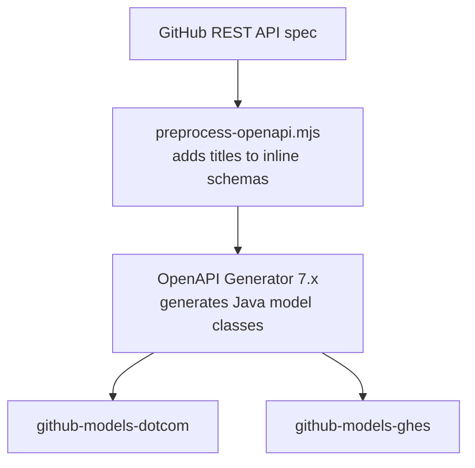

# github-models

Type-safe Java model classes generated from GitHub's REST API OpenAPI specifications.

Two artifacts are published separately — one for **GitHub.com** and one for **GitHub Enterprise Server (GHES)** — so you only include what you need.

## How it works

Models are generated automatically from GitHub's official [rest-api-description](https://github.com/github/rest-api-description) OpenAPI specs using [OpenAPI Generator](https://openapi-generator.tech/). A custom preprocessing step walks the spec and adds `title` properties to inline schemas, preventing naming collisions like `Repository1` / `Repository2`.

A GitHub Actions workflow runs daily, detects any spec updates, regenerates the models, and publishes a new release to Maven Central — no manual intervention needed.



## Installation

### GitHub.com models

**Maven:**

```xml
<dependency>
    <groupId>com.github.bgalek.github</groupId>
    <artifactId>github-models-dotcom</artifactId>
    <version>0.0.2</version>
</dependency>
```

**Gradle:**

```kotlin
implementation("com.github.bgalek.github:github-models-dotcom:0.0.2")
```

### GitHub Enterprise Server models

**Maven:**

```xml
<dependency>
    <groupId>com.github.bgalek.github</groupId>
    <artifactId>github-models-ghes</artifactId>
    <version>0.0.2</version>
</dependency>
```

**Gradle:**

```kotlin
implementation("com.github.bgalek.github:github-models-ghes:0.0.2")
```

## Usage

All models are plain Jackson-annotated Java classes. Deserialize a GitHub webhook payload or API response with any `ObjectMapper`:

```java
ObjectMapper mapper = new ObjectMapper();

// Deserialize a webhook event payload
Repository repository = mapper.readValue(json, Repository.class);

// Deserialize a pull request sync webhook
WebhookPullRequestSynchronize event = mapper.readValue(json, WebhookPullRequestSynchronize.class);
```

Models use `@JsonProperty`, `@JsonPropertyOrder`, and `@JsonTypeName` annotations, and are annotated with `@Nonnull` / `@Nullable` from [JSpecify](https://jspecify.dev/) for static analysis support.
